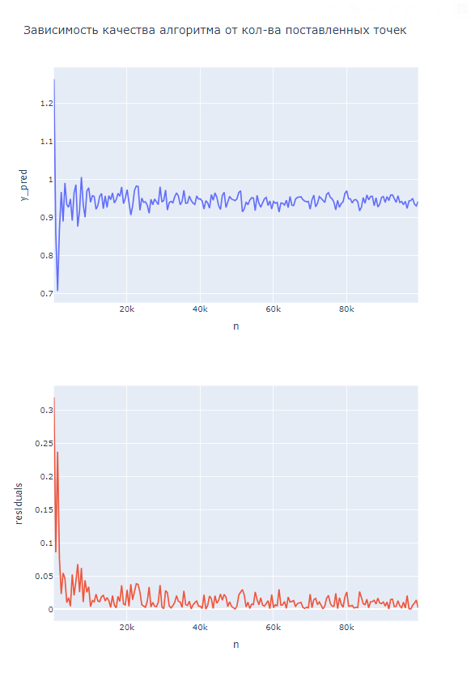
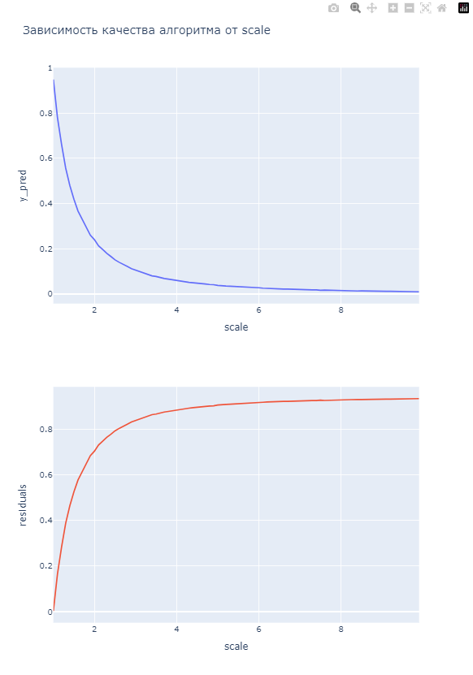

[основной код](https://github.com/GrishaTS/IHW3A1/blob/main/main.cpp) - 293004360
_____
[валидация, формирование csv](https://github.com/GrishaTS/IHW3A1/blob/main/validation.cpp)
_____
[отрисовка и выводы](https://github.com/GrishaTS/IHW3A1/blob/main/visualization.ipynb)
_____

- При увеличении плотности точек точность предсказанной площади растет.
- При увеличении плотности точек точность предсказанной площади растет => уменьшается и разница с правильным значением.
_____

- При увеличении масштаба, плотность расставленных точек уменьшается => уменьшается точность.
- Соотвественно и увеличивается разница с правильным ответом. 
_____
ВЫВОД: При использованиит метода Монте-Карла по возможности стоит выбирать большее кол-во точек и наименьший возможный масштаб.